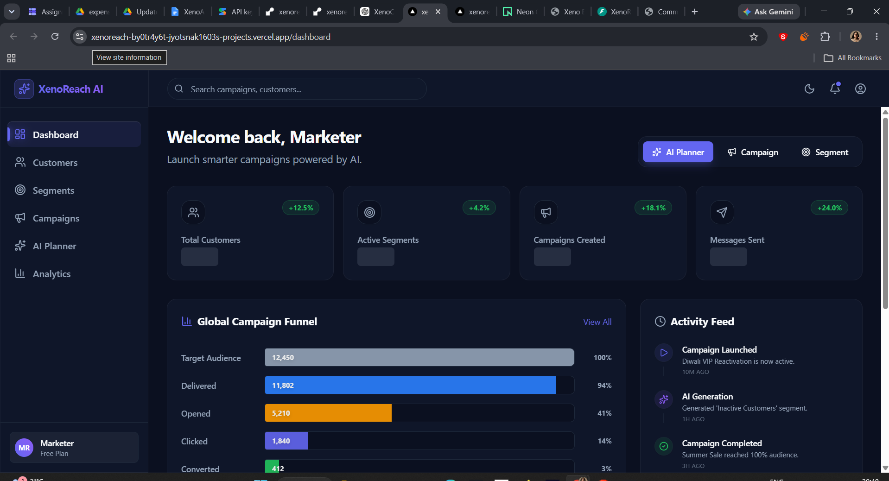
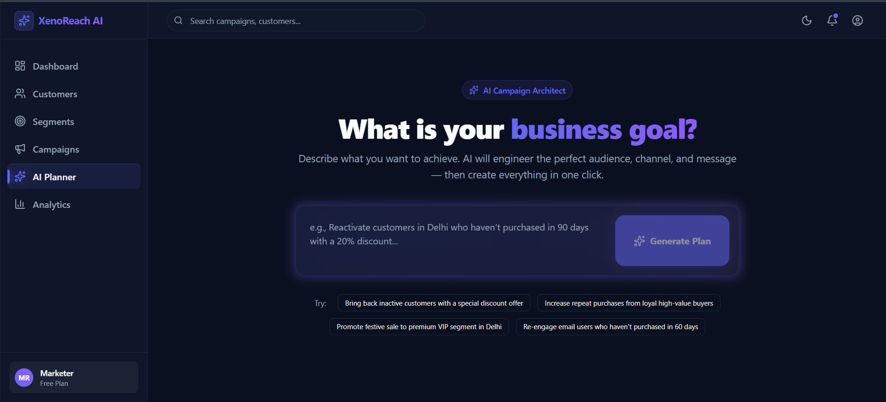
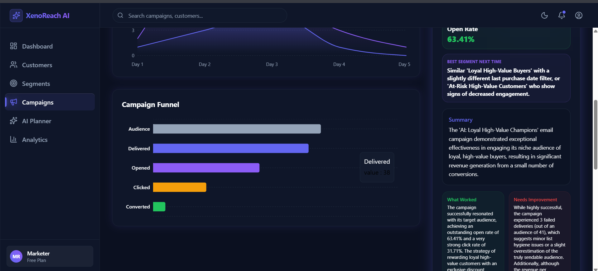
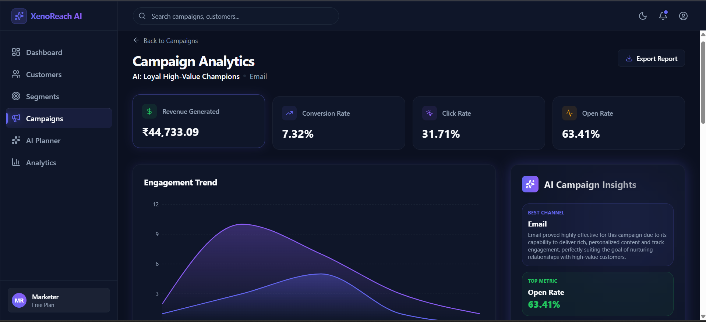

# XenoReach AI

## AI-Native Campaign Intelligence CRM

XenoReach AI is an AI-assisted marketing CRM built for the Xeno SDE Internship Assignment 2026.

It helps D2C and retail brands identify the right audience, generate campaign messages, choose communication channels, launch campaigns, and analyze communication performance through a realistic event-driven communication workflow.

---

## Live Demo

**Frontend:**
https://xenoreach-ai.vercel.app

**Backend API:**
https://xenoreach-backend-l9eh.onrender.com

**Walkthrough Video:**
To be added before final submission

**GitHub Repository:**
https://github.com/jyotsnak1603/xenoreach-ai

---

## Problem Statement

D2C brands often have customer and order data but still struggle to answer key marketing questions:

* Which customers should we target?
* What message should we send?
* Which channel should we use?
* How did the campaign perform?
* What can we learn from the results?

XenoReach AI combines customer data, audience segmentation, AI recommendations, campaign execution, and analytics into a single workflow.

---

## Why XenoReach AI?

While collecting customer data is relatively easy, turning that data into effective campaigns remains difficult.

XenoReach AI focuses on helping marketers make better decisions by answering:

* Who should we target?
* What should we say?
* Which channel should we use?
* Why did a campaign succeed or fail?

The product uses AI to assist decision-making while keeping marketers in control of campaign execution.

---

## Product Vision

I chose a human-in-the-loop AI approach instead of a fully autonomous agent.

Workflow:

1. Marketer enters a business goal.
2. AI recommends audience, message, and channel.
3. Marketer reviews and edits recommendations.
4. Campaign is launched.
5. Communication events are simulated.
6. Analytics and AI insights evaluate performance.

This balances automation, transparency, and user trust.

---

## Core Features

### Customer & Order Management

* Customer ingestion
* Order ingestion
* Realistic seed data

### Audience Segmentation

* Rule-based segments
* AI-assisted segment recommendations
* Dynamic audience resolution

### AI Campaign Planner

* Goal → Audience
* Goal → Message
* Goal → Channel
* Goal → Reasoning

### Campaign Management

* Campaign creation
* Campaign launch
* Audience snapshotting
* Communication tracking

### Channel Simulator

* Separate service
* Asynchronous callbacks
* Simulated delivery and engagement events

### Analytics & Insights

* Sent, delivered, failed metrics
* Opened, clicked, converted metrics
* AI-generated campaign insights

---

## Screenshots

### Dashboard



### AI Campaign Planner



### Campaign Management




---


### Communication Flow

Marketer → Campaign → Communications → Channel Simulator → Callback API → Communication Events → Analytics

The channel simulator is implemented as a separate service and asynchronously sends delivery and engagement events back to the CRM through callback APIs.

---

## Key Design Decisions

### Human-in-the-Loop AI

AI provides recommendations, but marketers approve campaigns before launch.

**Reason:** Improves trust, explainability, and control.

### Separate Channel Simulator

A dedicated channel service simulates message delivery and engagement.

**Reason:** Mirrors real-world messaging provider architecture.

### Communication vs CommunicationEvent

* Communication = latest state
* CommunicationEvent = complete event history

**Reason:** Fast analytics with full auditability.

### Audience Snapshot at Launch

Audience size is stored when a campaign launches.

**Reason:** Analytics remain historically accurate even if segments change later.

### Stored AI Recommendations

AI outputs are stored separately.

**Reason:** Explainability and future analysis.

---

## Scalability Considerations

For assignment scope, I used lightweight asynchronous processing.

For production-scale systems, I would introduce:

* Celery workers
* Redis / RabbitMQ
* Retry queues
* Dead-letter queues
* Batch processing
* Event streaming
* Distributed workers
* Rate limiting

---

## What I Chose Not To Build

To remain focused on campaign intelligence, I intentionally excluded:

* Real WhatsApp/SMS/Email integrations
* Sales CRM functionality
* Leads and pipelines
* Support ticketing
* Billing and payments
* Multi-tenant architecture
* Complex role management
* Production-grade queue infrastructure

---

## AI-Native Development Workflow

As encouraged in the assignment, I used AI as a development companion throughout the project.

AI assisted with:

* Product ideation
* Architecture exploration
* API planning
* Debugging
* Documentation refinement
* Evaluating implementation alternatives

All final design decisions, tradeoffs, feature choices, and implementation details were reviewed and validated by me.

---

## Tech Stack

### Frontend

* Next.js
* React
* Tailwind CSS

### Backend

* Django
* Django REST Framework

### Database

* PostgreSQL / Neon

### AI

* Gemini API

### Deployment

* Vercel
* Render

---

## Local Setup

### Backend

```bash
cd crm-backend
pip install -r requirements.txt
python manage.py migrate
python manage.py runserver
```

### Frontend

```bash
cd frontend
npm install
npm run dev
```

### Channel Service

```bash
cd channel-service
pip install -r requirements.txt
uvicorn app.main:app --reload
```

---

## Environment Variables

### Backend

```env
DATABASE_URL=your_database_url
GEMINI_API_KEY=your_gemini_api_key
CHANNEL_SERVICE_URL=your_channel_service_url
```

### Frontend

```env
NEXT_PUBLIC_API_BASE_URL=your_backend_api_url
```

### Channel Service

```env
CRM_CALLBACK_URL=your_crm_callback_url
```

---

## Future Improvements

* A/B testing
* Real provider integrations
* Campaign scheduling
* Predictive customer scoring
* Multi-tenant support
* Advanced analytics
* Autonomous campaign optimization

---

## Author

Jyotsna Chaudhary

Xeno SDE Internship Assignment 2026
